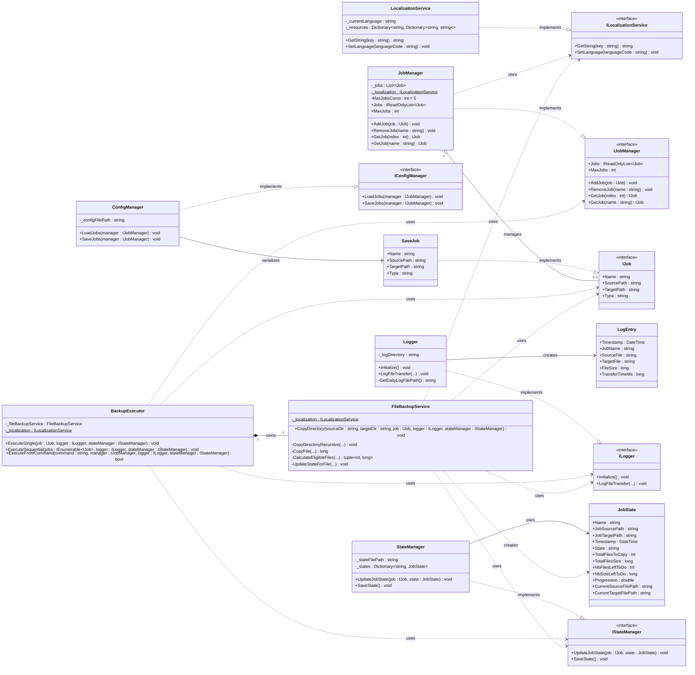

# EasySave - UML Class Diagram

```mermaid
classDiagram
    direction LR

    %% ═══════════════════════════════════════════════════════════════
    %% GROUPE 1: JOBS (gauche)
    %% ═══════════════════════════════════════════════════════════════

    class IJob {
        <<interface>>
        +Name : string
        +SourcePath : string
        +TargetPath : string
        +Type : string
    }

    class SaveJob {
        +Name : string
        +SourcePath : string
        +TargetPath : string
        +Type : string
    }

    class IJobManager {
        <<interface>>
        +Jobs : IReadOnlyList~IJob~
        +MaxJobs : int
        +AddJob(job : IJob) void
        +RemoveJob(name : string) void
        +GetJob(index : int) IJob
        +GetJob(name : string) IJob
    }

    class JobManager {
        -_jobs : List~IJob~
        -_localization : ILocalizationService$
        -MaxJobsConst : int = 5
        +Jobs : IReadOnlyList~IJob~
        +MaxJobs : int
        +AddJob(job : IJob) void
        +RemoveJob(name : string) void
        +GetJob(index : int) IJob
        +GetJob(name : string) IJob
    }

    %% Relations Jobs
    SaveJob ..|> IJob : implements
    JobManager ..|> IJobManager : implements
    JobManager "1" o-- "0..5" IJob : manages

    %% ═══════════════════════════════════════════════════════════════
    %% GROUPE 2: CONFIGURATION
    %% ═══════════════════════════════════════════════════════════════

    class IConfigManager {
        <<interface>>
        +LoadJobs(manager : IJobManager) void
        +SaveJobs(manager : IJobManager) void
    }

    class ConfigManager {
        -_configFilePath : string
        +LoadJobs(manager : IJobManager) void
        +SaveJobs(manager : IJobManager) void
    }

    %% Relations Config
    ConfigManager ..|> IConfigManager : implements
    ConfigManager --> SaveJob : serializes

    %% ═══════════════════════════════════════════════════════════════
    %% GROUPE 3: LOCALISATION (centre-haut)
    %% ═══════════════════════════════════════════════════════════════

    class ILocalizationService {
        <<interface>>
        +GetString(key : string) string
        +SetLanguage(languageCode : string) void
    }

    class LocalizationService {
        -_currentLanguage : string
        -_resources : Dictionary~string, Dictionary~string, string~~
        +GetString(key : string) string
        +SetLanguage(languageCode : string) void
    }

    %% Relations Localisation
    LocalizationService ..|> ILocalizationService : implements
    JobManager ..> ILocalizationService : uses

    %% ═══════════════════════════════════════════════════════════════
    %% GROUPE 4: EXECUTION (centre)
    %% ═══════════════════════════════════════════════════════════════

    class BackupExecutor {
        -_fileBackupService : FileBackupService
        -_localization : ILocalizationService$
        +ExecuteSingle(job : IJob, logger : ILogger, stateManager : IStateManager) void
        +ExecuteSequential(jobs : IEnumerable~IJob~, logger : ILogger, stateManager : IStateManager) void
        +ExecuteFromCommand(command : string, manager : IJobManager, logger : ILogger, stateManager : IStateManager) bool
    }

    class FileBackupService {
        -_localization : ILocalizationService$
        +CopyDirectory(sourceDir : string, targetDir : string, job : IJob, logger : ILogger, stateManager : IStateManager) void
        -CopyDirectoryRecursive(...) void
        -CopyFile(...) long
        -CalculateEligibleFiles(...) tuple~int, long~
        -UpdateStateForFile(...) void
    }

    %% Relations Execution
    BackupExecutor "1" *-- "1" FileBackupService : owns
    BackupExecutor ..> IJob : uses
    BackupExecutor ..> IJobManager : uses
    FileBackupService ..> IJob : uses
    FileBackupService ..> ILocalizationService : uses

    %% ═══════════════════════════════════════════════════════════════
    %% GROUPE 5: STATE (droite-haut)
    %% ═══════════════════════════════════════════════════════════════

    class IStateManager {
        <<interface>>
        +UpdateJobState(job : IJob, state : JobState) void
        +SaveState() void
    }

    class StateManager {
        -_stateFilePath : string
        -_states : Dictionary~string, JobState~
        +UpdateJobState(job : IJob, state : JobState) void
        +SaveState() void
    }

    class JobState {
        +Name : string
        +JobSourcePath : string
        +JobTargetPath : string
        +Timestamp : DateTime
        +State : string
        +TotalFilesToCopy : int
        +TotalFilesSize : long
        +NbFilesLeftToDo : int
        +NbSizeLeftToDo : long
        +Progression : double
        +CurrentSourceFilePath : string
        +CurrentTargetFilePath : string
    }

    %% Relations State
    StateManager ..|> IStateManager : implements
    StateManager --> JobState : uses
    BackupExecutor ..> IStateManager : uses
    FileBackupService ..> IStateManager : uses
    FileBackupService ..> JobState : creates

    %% ═══════════════════════════════════════════════════════════════
    %% GROUPE 6: LOGGING (droite)
    %% ═══════════════════════════════════════════════════════════════

    class ILogger {
        <<interface>>
        +Initialize() void
        +LogFileTransfer(...) void
    }

    class Logger {
        -_logDirectory : string
        +Initialize() void
        +LogFileTransfer(...) void
        -GetDailyLogFilePath() string
    }

    class LogEntry {
        +Timestamp : DateTime
        +JobName : string
        +SourceFile : string
        +TargetFile : string
        +FileSize : long
        +TransferTimeMs : long
    }

    %% Relations Logging
    Logger ..|> ILogger : implements
    Logger --> LogEntry : creates
    BackupExecutor ..> ILogger : uses
    FileBackupService ..> ILogger : uses
```
