# EasySave - Diagrammes de Séquence

## 1. Initialisation de l'application

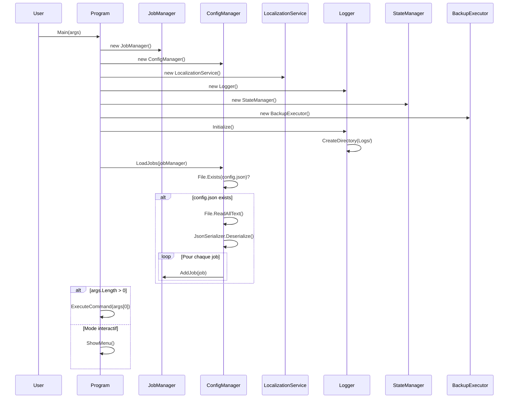

---

## 2. Création d'un job

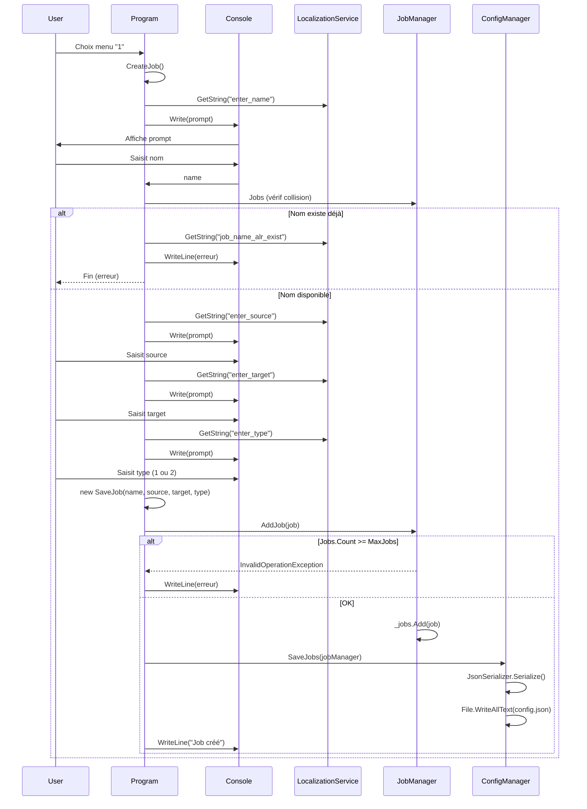

---

## 3. Suppression d'un job

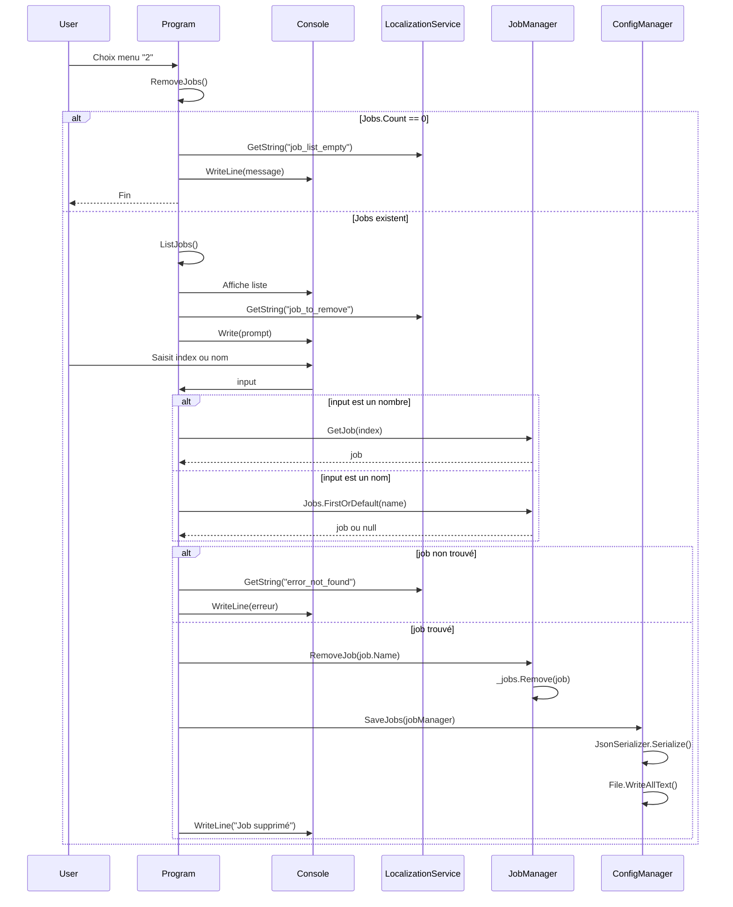

---

## 4. Modification d'un job

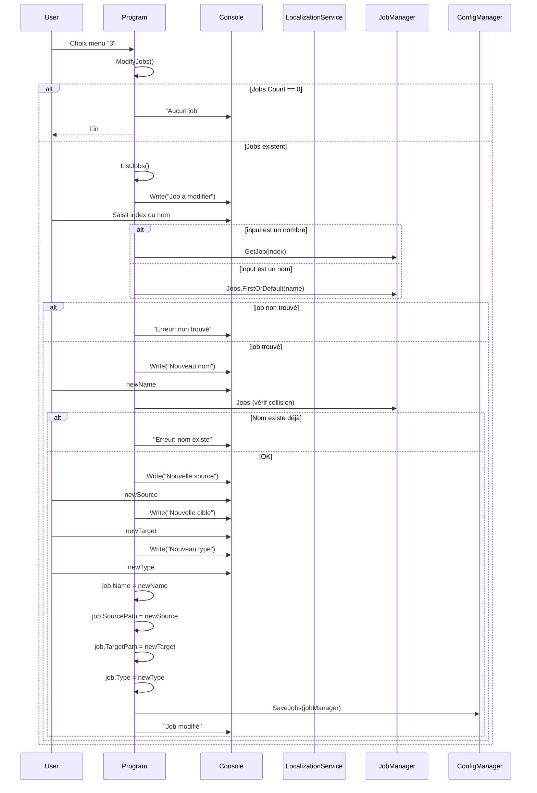

---

## 5. Exécution d'une sauvegarde (flux principal)

```mermaid
sequenceDiagram
    participant User
    participant Program
    participant BackupExecutor
    participant FileBackupService
    participant StateManager
    participant Logger

    User->>Program: Choix menu "5"
    Program->>Program: ExecuteBackup()
    Program->>Program: ListJobs()

    Program->>User: "Entrez les jobs (ex: 1 | 2-5 | 1;3;4)"
    User->>Program: command (ex: "1-3")

    Program->>Program: ExecuteCommand(command)
    Program->>BackupExecutor: ExecuteFromCommand(command, jobManager, logger, stateManager)

    BackupExecutor->>BackupExecutor: Parse command (split par ";")

    loop Pour chaque partie
        alt Format "X-Y" (range)
            BackupExecutor->>BackupExecutor: Extraire start et end
            BackupExecutor->>BackupExecutor: Ajouter indexes [start..end]
        else Format "X" (single)
            BackupExecutor->>BackupExecutor: Ajouter index
        end
    end

    BackupExecutor->>BackupExecutor: Valider bornes (1 <= index <= Jobs.Count)

    alt Index invalide
        BackupExecutor-->>Program: return false
        Program->>User: Erreur affichée
    else Indexes valides
        loop Pour chaque index
            BackupExecutor->>BackupExecutor: jobManager.GetJob(index)
        end

        BackupExecutor->>BackupExecutor: ExecuteSequential(jobs, logger, stateManager)

        loop Pour chaque job
            BackupExecutor->>BackupExecutor: ExecuteSingle(job, logger, stateManager)
            Note over BackupExecutor: Voir diagramme 6
        end

        BackupExecutor-->>Program: return true
        Program->>User: "Sauvegarde terminée"
    end
```

---

## 6. Exécution d'un job unique (ExecuteSingle)

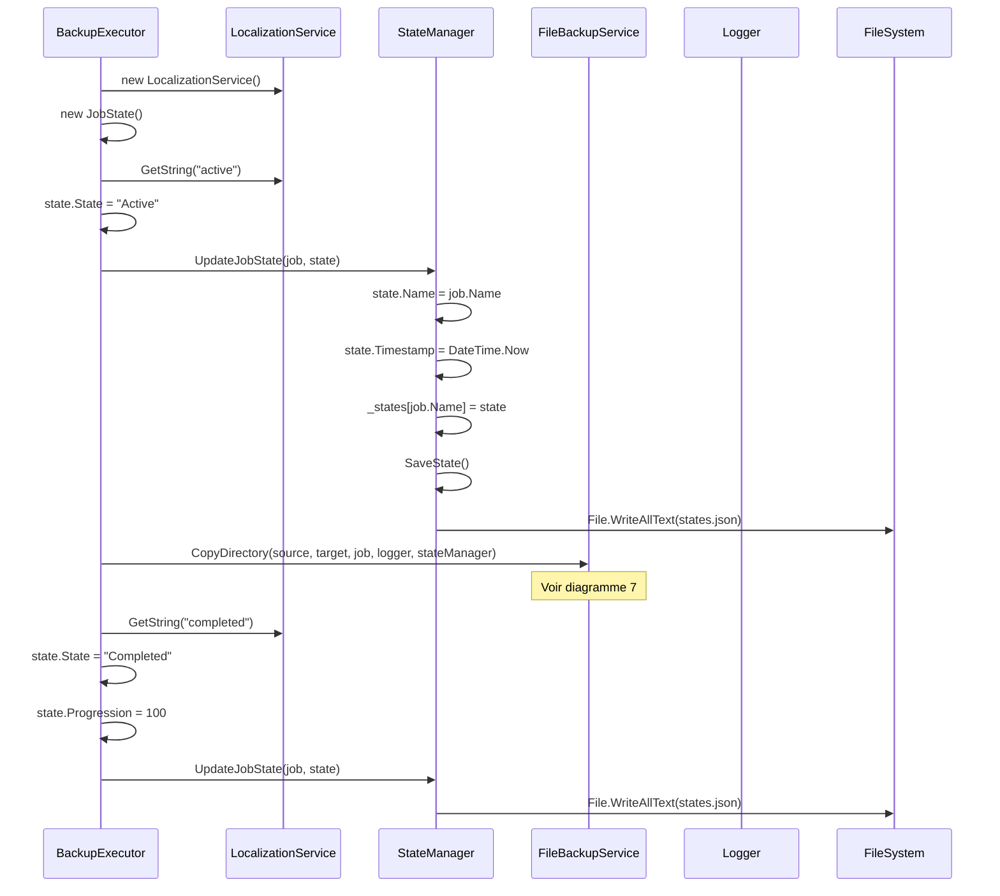

---

## 7. Copie de répertoire (FileBackupService)

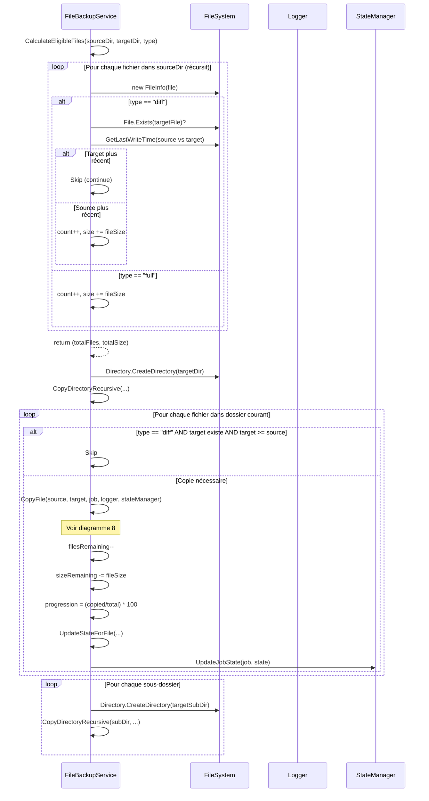

---

## 8. Copie d'un fichier unique

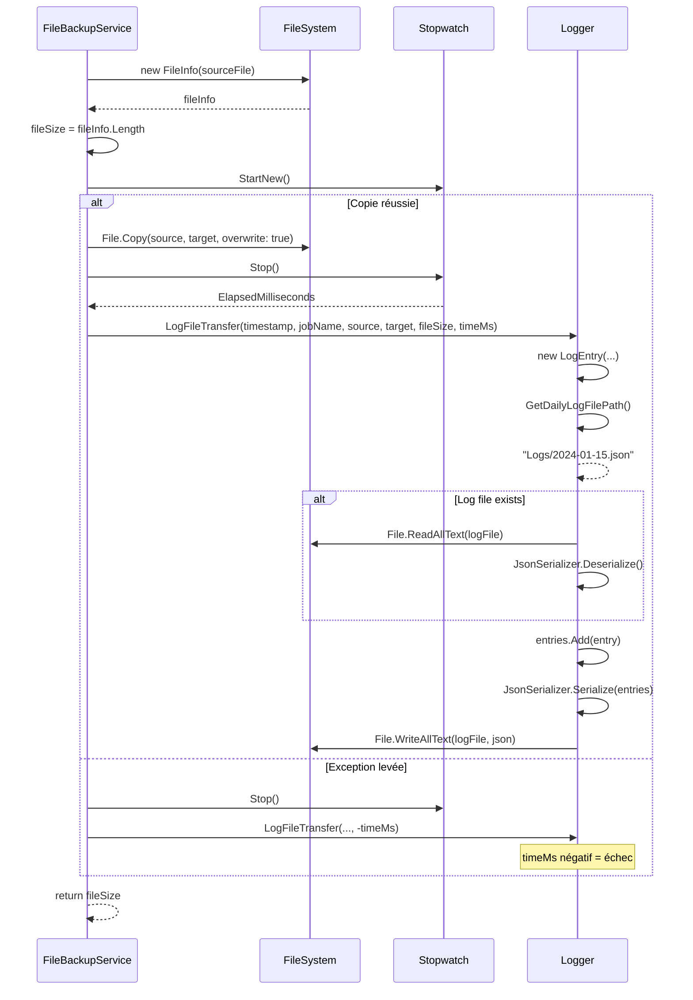

---

## 9. Changement de langue

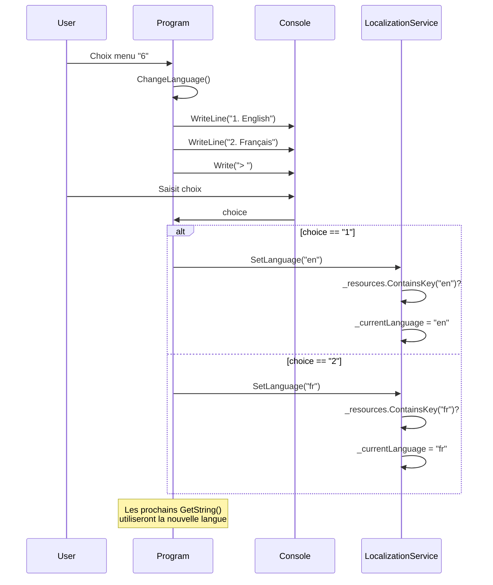

---

## 10. Chargement de la configuration (au démarrage)

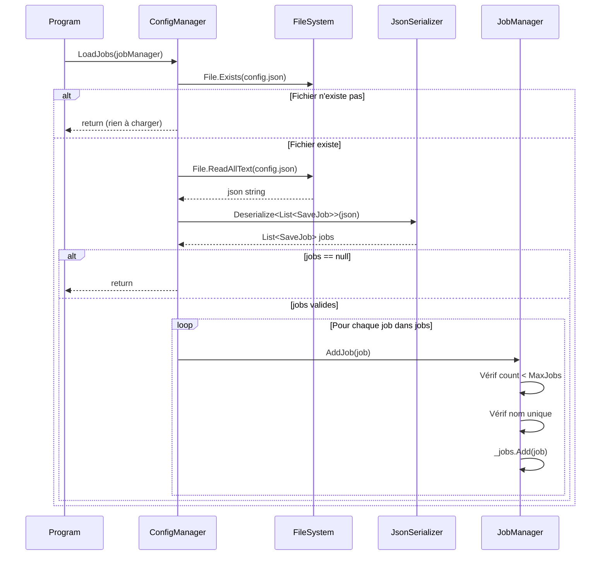

---

## 11. Sauvegarde de la configuration

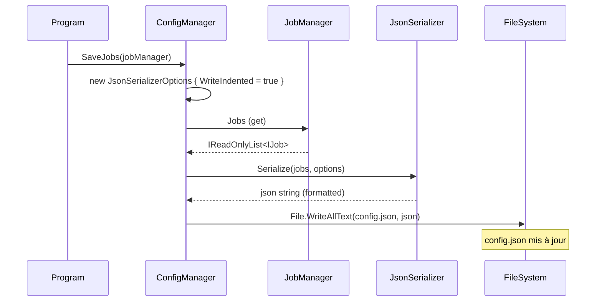

---

## 12. Mise à jour de l'état (StateManager)

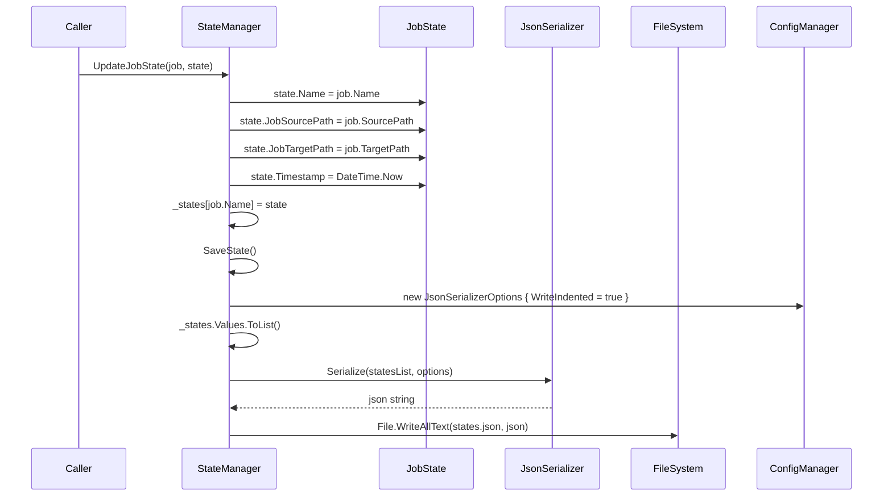
